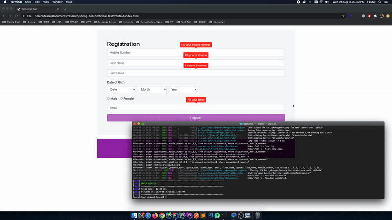

# Registration Application
Register application, this application have divided to three part : Web Application, Backend Application, Database.

## Web Page 
Web Page Application using HTML5, Jquery and Boostrap, and see the documentation of Web Page. For open webpage service go to folder frontend and open <strong>index.html</strong>.


## Backend
On Backend Application using SpringBoot. It have unit testing using Junit, handler exception,In Memory Database (H2) for Testing, and Database Postges for real register, and communitate with database using ORM. For running backend service go to backend and run
```  mvn spring-boot:run ```. Before run backend service, make sure the database connection can integrate with backend application.

## Database
Database for register using postgres, in database folder is a dump file for import the data structures and data.